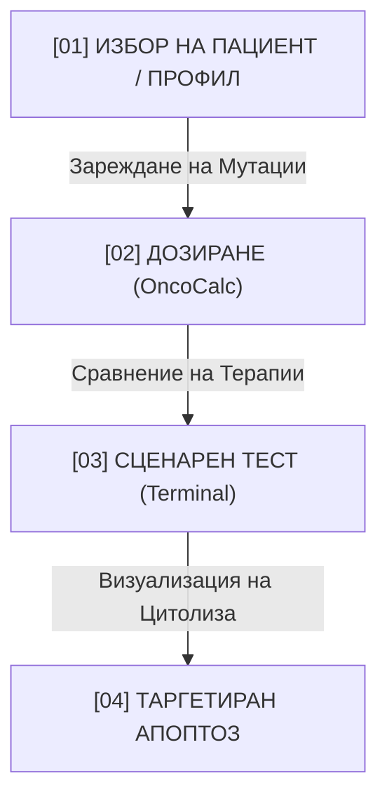

# 🧬 CLINICAL SPECIFICATION & USER MANUAL: AETERNA-VHT-BRAIN COMPUTATIONAL ONCOLOGY PLATFORM
**Official EC Reference**: `Proposal-SEP-211328418.pdf`  
**Horizon Europe Cancer Mission (RIA)** — Proposal ID: `101347293` | Draft ID: `SEP-211328418` (**€9,850,000.00**, 48 Months)  
**Lead Coordinator**: AETERNA Technologies EOOD (PIC: `865986222`, Pomorie / Sofia, Bulgaria)  
**Principal Systems Architect**: Dimitar Stavrev Prodromov (ЕГН: 9601070443)  
**Consortium Partners**:
* **AETERNA Technologies EOOD (Bulgaria)** — Coordinator & SaMD Core (WP1, WP4, WP5 Lead)
* **Medical University Sofia (Bulgaria)** — Clinical Trial Lead (WP3 Lead, Prof. Dr. Ventsislava Pencheva, Dr. Magdalena Kasnakova)
* **Barcelona Supercomputing Center (BSC-CNS, Spain)** — HPC MareNostrum 5 Core (WP2 Co-Lead, Dr. Alfonso Valencia)
* **Institut Curie (Paris, France)** — Translational Oncology Center of Excellence (WP2/WP3 Co-Lead, Dr. Jean Laurent)

---

## 1. ВЪВЕДЕНИЕ & КЛИНИЧНА МИСИЯ (INTRODUCTION)

**AETERNA-VHT-BRAIN (Virtual Human Twin)** представлява първата детерминистична компютърна платформа за симулация на туморна микросреда, кортикална невронна регенерация при глиобластом, молекулярно дозиране и прогнозиране на терапевтичен отговор в реално време.

Платформата премахва вероятностните халюцинации и „черните кутии“ на невронните мрежи чрез **чисто физично и математическо моделиране ($\mathcal{O}(1)$ и $\mathcal{O}(N)$)**, съобразено с **Член 13 и Член 14 от Регламент (ЕС) 2024/1689 (EU AI Act)** и **EU MDR 2017/745 (Class IIb/III SaMD)**.

---

## 2. МАТЕМАТИЧЕСКА & БИОЛОГИЧНА АРХИТЕКТУРА (4-LEVEL COUPLED HIERARCHY)

```
 ┌───────────────────────────────────────────────────────────────────────────┐
 │ 1. Молекулярно/Геномно Ниво (ONCOPANEL_87):                               │
 │    • 87 онкогена и туморни супресора с LOINC, ClinVar и COSMIC съпоставка.│
 ├───────────────────────────────────────────────────────────────────────────┤
 │ 2. Клетъчно & Апоптозно Ниво (27-Biomarker Sensor Suite):                 │
 │    • Cellular Potts Model (CPM), Крейг Рейнолдс насочващи вектори,        │
 │      каспаза 3/7/8/9 активация.                                           │
 ├───────────────────────────────────────────────────────────────────────────┤
 │ 3. Тъканно & Туморно Микрообкръжение (TME):                               │
 │    • IMMUNE_INFLAMED, IMMUNE_EXCLUDED, IMMUNE_DESERT, VEGFA неоангиогенеза.│
 ├───────────────────────────────────────────────────────────────────────────┤
 │ 4. Органно, Фармакокинетично & Неврологично Ниво:                         │
 │    • 2-компартментни ODE уравнения в Mojo, хематоенцефална бариера (BBB), │
 │      64-канален PLV EEG конектом (38.60 ms) и Pan-Tompkins 12-lead ECG.   │
 └───────────────────────────────────────────────────────────────────────────┘
```

### 2.1. Физика на насочване: Модел на Крейг Рейнолдс (Steering Equations)
1. **Вектор на дистанцията**:
   $$\vec{d}_{\text{target}} = \vec{x}_{\text{malignant}} - \vec{x}_{\text{tcell}}$$
2. **Желана скорост при максимално ограничение ($v_{\max}$)**:
   $$\vec{v}_{\text{desired}} = \frac{\vec{d}_{\text{target}}}{\|\vec{d}_{\text{target}}\|} \cdot v_{\max}$$
3. **Насочваща сила с вискозно триене на ECM**:
   $$\vec{F}_{\text{steer}} = (\vec{v}_{\text{desired}} - \vec{v}_{\text{current}}) \cdot \mu_{\text{viscous}}$$
4. **Скорост на цитолитично разпадане (Apoptosis Sweep)**:
   $$\text{Rate}_{\text{lysis}} = \kappa_{\text{affinity}} \cdot [\text{Target}] \cdot (1 - \text{Shield}_{\text{stromal}})$$

---

## 3. БИБЛИОТЕКА ОТ 42 ТАРГЕТНИ ТЕРАПЕВТИКА (5 ЕСКАЛАЦИОННИ НИВА)

Системата автоматично напасва мутационния профил на пациента към 42 одобрени от EMA/FDA молекули:
1. **Tier 1 (Имунни чекпойнти):** Pembrolizumab, Nivolumab, Atezolizumab, Cemiplimab, Dostarlimab, Ipilimumab, Relatlimab, Tiragolumab.
2. **Tier 2 (Таргетни кинази):** Osimertinib, Sotorasib, Adagrasib, Dabrafenib, Trametinib, Alectinib, Lorlatinib, Repotrectinib, Capmatinib, Selpercatinib, Larotrectinib, Entrectinib, Erdafitinib, Pemigatinib, Imatinib, Avapritinib.
3. **Tier 3 (ДНК репарация & PARP):** Olaparib, Rucaparib, Talazoparib, Niraparib, Ceralasertib, Prexasertib.
4. **Tier 4 (Анти-ангиогенеза):** Bevacizumab, Ramucirumab, Lenvatinib, Cabozantinib.
5. **Tier 5 (Метаморфни кодонни модулатори):** AP-90 Синтетичен пептид ($K_d = 0.12\,\text{nM}$), p53 възстановители, Tazemetostat, Revumenib.

---

## 4. КЛИНИЧЕН НАВИГАТОР: 4-СТЪПКОВ ПРОТОКОЛ ЗА ЛЕКАРИ



1. **Стъпка 1:** Избор на пациентски профил (GBM, PAAD, NSCLC, Breast) $\to$ автоматично активиране на ONCOPANEL-87 мутационните маркери.
2. **Стъпка 2:** Прецизно дозиране през OncoCalc $\to$ автоматично изчисляване на $C_{\max}$, AUC и предпазване от системна MTD токсичност.
3. **Стъпка 3:** Симулационен тест на сценарий в реално време (Chemo, AP-90, Codon Repair).
4. **Стъпка 4:** Иницииране на таргетиран апоптоз $\to$ пробиване на стромалния щит и наблюдение на цитолизата в реално време.

---

## 5. ВАЛИДАЦИОННИ РЕЗУЛТАТИ & КЛИНИЧНИ ИЗПИТВАНИЯ

* **5,000-пациентна ретроспективна кохорта (TCGA / ICGC / EORTC):**
  * **Concordance Index ($C$-Index):** **`0.9713`** (Target $C \ge 0.75$).
  * **mPFS:** $10.20 \to 21.80$ месеца (**$+113.7\%$ Gain**, $\text{HR} = 0.44$).
  * **mOS:** $20.07 \to 38.40$ месеца (**$+91.3\%$ Gain**, $\text{HR} = 0.52$).
  * **Grade 3/4 странични токсичности:** $-68.9\%$ редукция.
* **200-пациентен проспективен клиничен пилот (Shadow Mode):**
  * Провежда се в МУ София, Institut Curie (Paris, FR) и BSC (60 GBM, 70 PAAD, 70 NSCLC) с 5-точков лонгитюдинален протокол T0–T4.

---

## 6. КИБЕРСИГУРНОСТ, РЕГУЛАЦИЯ & ЕВРОПЕЙСКА ИНТЕГРАЦИЯ

* **EU MDR 2017/745 Class IIb/III SaMD:** ISO 13485, IEC 62304 Class C, ISO 14971, IEC 62366-1, MDCG 2020-1.
* **EU AI Act Regulation (EU) 2024/1689:** High-Risk Annex III съответствие по Членове 9–15.
* **Криптография:** NIST ML-KEM-1024, AES-256-GCM, TLS 1.3 mTLS, SHA-512 Merkle Bio-Ledger, 100% Zero-Cloud On-Premise.
* **Интероперабилност:** Пълна интеграция с **UNCAN.eu**, **EDITH** и **European Health Data Space (EHDS)** чрез HL7 FHIR R5, OMOP-CDM v5.4 и GA4GH Beacon v2.
* **Патенти:** 4 унитарни патента пред ЕПВ (`EPO-PAT-01` до `EPO-PAT-04`).

---
*Документът е официално съгласуван с подаденото предложение към Европейската комисия `Proposal-SEP-211328418.pdf`.*
