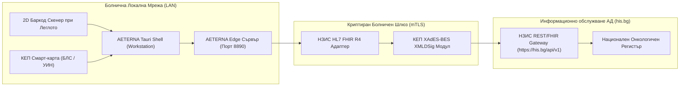

# ТЕХНИЧЕСКА СПЕЦИФИКАЦИЯ ЗА ИНТЕГРАЦИЯ С НЗИС („е-ЗДРАВЕ“ / his.bg)
## Платформа AETERNA-VHT • HL7 FHIR R4 Онкологичен Протокол
### Издател: „Информационно обслужване“ АД / Министерство на Здравеопазването на Република България
### Регулаторна рамка: Закон за здравето • Наредба № 1 • GDPR Член 9 • IEC 62304 Class C

---

## 1. Архитектурен Обзор

Националната здравноинформационна система (НЗИС), администрирана от „Информационно обслужване“ АД, управлява централизираното електронно здравно досие на българските граждани.
Платформата **AETERNA-VHT** се интегрира директно като сертифицирана специализирана медицинска система (SaMD / CDSS) чрез защитен B2B API шлюз.

---

## 2. Национален Референтен Номер (НРН / 12-Цифрен Баркод)

При постъпване на онкологичен пациент за химиотерапия или таргетно лечение, НЗИС издава **Електронно направление за хоспитализация (Бланка МЗ-НЗОК № 7)** с уникален 12-цифрен НРН баркод.

### Формат на НРН:
`[ГГ][ММ][ДД][ТТ][СССС][К]`
* `ГГММДД`: Дата на генериране (напр. `260914` за 14.09.2026 г.)
* `ТТ`: Тип на документа (`07` = Хоспитализация, `04` = Направление, `03` = Рецепта)
* `СССС`: Пореден сериен номер в националния клъстер
* `К`: Контролна цифра по алгоритъм Modulo 11

### Алгоритъм за валидация (Modulo 11):
Контролната цифра се проверява спрямо верификационните коефициенти: `w = [2, 4, 8, 5, 10, 9, 7, 3, 6, 1, 2, 4]`.
При оптично сканиране с 2D четеца на леглото, системата валидира номера моментално за < 1 ms преди изпращане на заявка към НЗИС.

---

## 3. HL7 FHIR R4 Структура на Онкологичния Bundle

Всички протоколи се генерират като FHIR R4 ресурс от тип `Bundle` с `type = "document"`.

### Съдържание на ресурсите в пакета:

1. **`Composition` (Заглавна част на клиничния протокол):**
   * `status`: `"final"`
   * `type`: LOINC `34076-0` (*Comprehensive oncology evaluation and management note*)
   * `author`: Лекуващ онколог с **УИН** (Уникален идентификационен номер от Български лекарски съюз)
   * `custodian`: Лечебно заведение с официален **РЗИ код** (Регионална здравна инспекция, напр. `2200000001`)

2. **`Patient` (Идентификация на пациента):**
   * `identifier`: Национален граждански номер (**ЕГН**) с контрол по Modulo 10
   * `meta.security`: GDPR Art. 9 псевдонимизиран хеш за де-идентификация при международни научни одити (Institut Curie / CERN)

3. **`Condition` (Онкологична диагноза по МКБ-10):**
   * МКБ-10 кодове:
     * `C50.9`: Злокачествено новообразувание на млечната жлеза
     * `C34.9`: Злокачествено новообразувание на бронхите и белия дроб
     * `C18.9`: Злокачествено новообразувание на дебелото черво
     * `C61`: Злокачествено новообразувание на простатата
     * `C43.9`: Злокачествен меланом на кожата

4. **`Observation` (Молекулярен панел с официални LOINC кодове):**
   | Ген / Биомаркер | Официален LOINC Код | Клинично Тълкувание |
   |---|---|---|
   | **TP53** | `85337-4` | Соматична мутация (R175H/R273H/R248Q) -> Активира спирачка по Селие |
   | **KRAS** | `62358-7` | Мутационен статус (Кодон 12/13) -> Резистентност към anti-EGFR |
   | **EGFR** | `62357-9` | Делеция в екзон 19 / L858R мутация |
   | **BRAF** | `69548-6` | Мутация V600E -> Индикация за таргетна комбинация |
   | **HER2 / ERBB2** | `48676-1` | Генна амплификация / свръхекспресия (IHC 3+ / FISH+) |
   | **Ki-67 Index** | `43221-1` | Пролиферативен индекс на тумора (%) |
   | **eGFR / CrCl** | `33914-3` | Креатининов клирънс по Cockcroft-Gault (mL/min) |

5. **`MedicationAdministration` (Аптечно смесване и приложение при леглото):**
   * Прецизна доза, преизчислена спрямо телесната повърхност (BSA по Mosteller)
   * Баркод на приготвената банка (GS1 DataMatrix)
   * Резултат от гравиметричния тест за плътност (ISO 17025)
   * Двоен електронен подпис: Болничен магистър-фармацевт + Ординиращ онколог

---

## 4. Квалифициран Електронен Подпис (КЕП / XAdES-BES)

Съгласно Закона за електронния документ и електронните удостоверителни услуги (ЗЕДЕУУ) и изискванията на „Информационно обслужване“ АД, всеки пакет към НЗИС се подписва с **XAdES-BES** цифров подпис на лекаря:

* **Стандарт:** ETSI EN 319 132-1
* **Дайджест алгоритъм:** SHA-256 / SHA-512
* **Сертификационни доставчици (КЕП):**
  * „Борика“ АД (B-Trust)
  * „Инфонотари“ ЕАД
  * „Евротръст Технолъджис“ АД
  * „Системи за електронни плащания / Спектър“ (StampIT)

---

## 5. Сигурност и Защита на Личните Данни (GDPR Член 9)

1. **Изолация на личните данни:** ЕГН и трите имена на пациента напускат болничната мрежа **единствено** по криптиран TLS 1.3 канал към официалния защитен шлюз на НЗИС (`https://his.bg`).
2. **Научен контур:** Всички данни, изпращани към международните партньори (Institut Curie, CERN Zenodo), са напълно де-идентифицирани чрез еднопосочен криптографски псевдонимизатор (HMAC-SHA-512 със секретен болничен сол ключ).
3. **Одитна следа:** Всяка транзакция се записва в непрекъсната Merkle верига (EU AI Act Чл. 12/14) с точно време до микросекунда.
