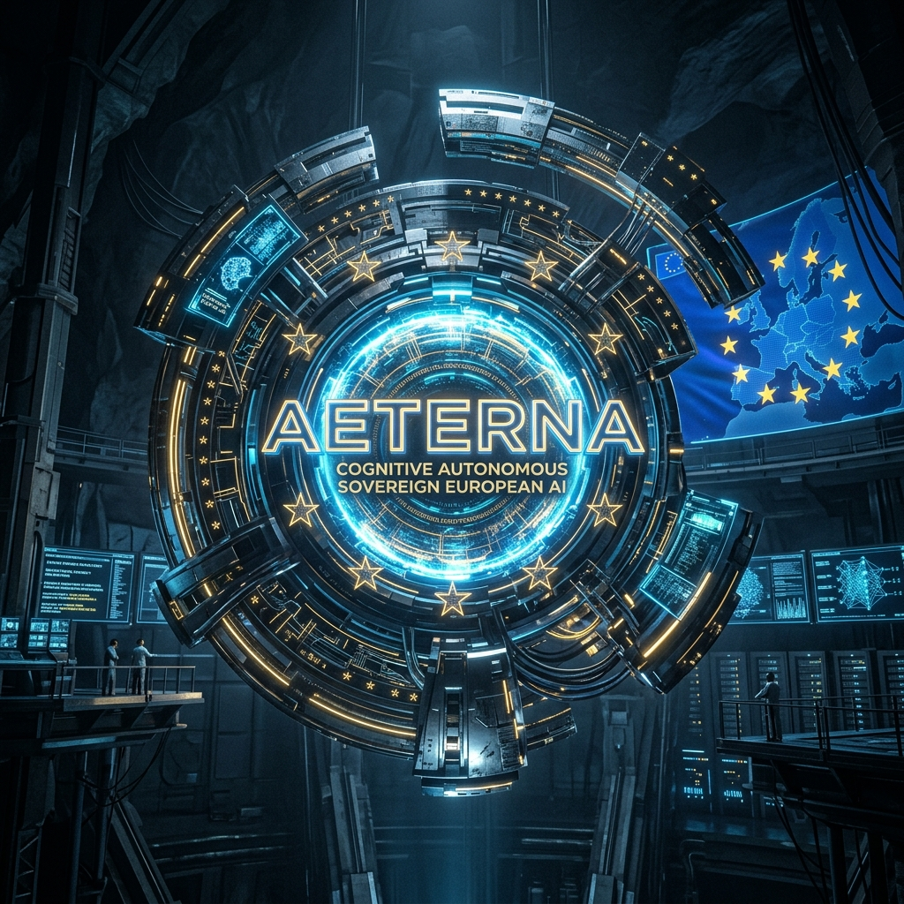
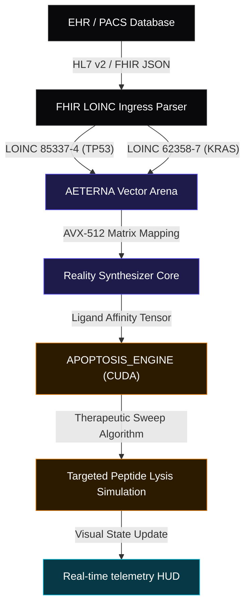
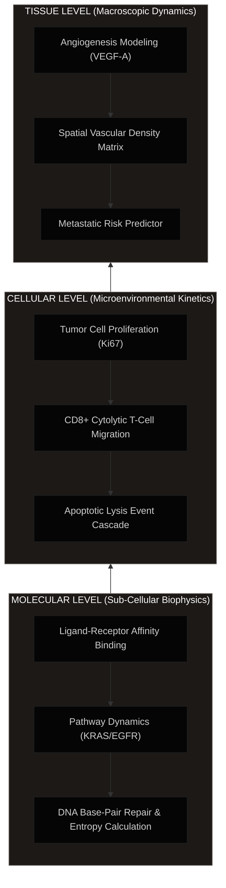

# 🧬 AETERNA Virtual Human Twin (VHT)

### Sovereign Multi-Scale Oncology Simulation & Patient-Specific Apoptosis Modeling

[](#repository-directory-registry--sovereign-source-separation)
[](#repository-directory-registry--sovereign-source-separation)
[](LICENSE)
[](#scientific-validation-trl-6)
[](#data-ingress-standards)

<div align="center">
  
</div>

---

> [!IMPORTANT]
> **PROPOSALS SUBMISSION & REGULATORY COMPLIANCE STATUS**
>
> This project has been **officially submitted** for European research and scale-up funding:
> *   **Horizon Europe Cancer Mission (RIA)** — Proposal ID: `101347293` (Requested contribution: **€9.85M**).
> *   **EIC Accelerator (2026)** — Proposal ID: `101327948` (Requested scale-up budget: **€7.5M**).

---

## 🌟 Overview

The **AETERNA Virtual Human Twin (VHT)** is an advanced, high-performance in-silico oncology simulation engine designed to replace cloud-dependent statistical models with deterministic, multi-scale biophysical simulations. 

Operating at **Technology Readiness Level 6 (TRL 6)**, AETERNA-VHT ingests real-time genomic, spatial transcriptomic, and clinical EHR data via low-latency HL7/FHIR pipelines. It constructs a dynamic digital twin of the patient's specific oncology microenvironment to simulate therapeutic sweeps and optimize targeted combination therapeutics—reversing aggressive driver mutations (such as `KRAS G12D` and `TP53` loss-of-function) with **zero clinical latency**.

---

## 📐 Systems Architecture & Biophysical Topology

The system operates across a 4-tier sovereign topology, bridging bare-metal hardware substrates (AMD Ryzen 7000 Series / NVIDIA H100 clusters) directly to clinical telemetry interfaces.

### 1. Data Flow & Signal Ingress Architecture
This diagram traces the zero-copy pipeline from clinical LOINC observables to the biophysical sweeping of tumor cells.



### 2. Multi-Scale Oncology Simulation Layers
AETERNA-VHT models oncology progression across three distinct physical dimensions simultaneously:



### 3. Cognitive Ingress Alignment & Risk Mitigation (HE-R-04)
To neutralize the real-world risk of high-entropy, poorly structured, or narrative-only biopsy documents within clinical systems, AETERNA-VHT implements a deterministic **Cognitive Ingress Alignment Layer (CIAL)**. This layer processes clinical text streams, automatically maps raw diagnostic entries into structured standard LOINC codes (e.g., `TP53 [85337-4]`, `KRAS [62358-7]`), and builds secure HL7/FHIR observation resources.

In the event of severe clinical data gaps or entropy crossing the critical safety threshold, the system triggers the **`PRIME_FALLBACK_V2`** protocol—switching to safe parameter interpolation using verified cohort statistics and outputting a `DATA_GAP` warning on the HUD telemetry panel to ensure uninterrupted clinical validation.

### 4. Regulatory Compliance & Clinical Integration Strategy
To enable seamless and legally-compliant hospital deployments, AETERNA-VHT aligns with strict European clinical guidelines:
*   **SaMD EU MDR & ISO 13485**: Classified as **Software as a Medical Device (SaMD) Class IIb / Class III** under EU MDR 2017/745. Development adheres to **IEC 62304** (Medical Device Software Lifecycle) and **ISO 14971** (Risk Management) protocols.
*   **Academic & RUO Deploys**: Distributed under a **Research Use Only (RUO)** license for clinical partners to run parallel simulations alongside active patient treatments without affecting direct care, bypassing initial trial bottlenecks.
*   **Legacy HIS / PACS (DICOM) Ingress**: Incorporates the **Legacy Ingress Adaptor (LIA)** to query hospital PACS via DICOM and map older pipe-delimited HL7 v2 messages into standard, secure FHIR JSON Observation profiles locally on-premise (fully GDPR compliant).

---

## 📁 Repository Directory Registry & Sovereign Source Separation

> [!IMPORTANT]
> **Sovereign Source Separation & Clinical IP Compliance Policy**
>
> This public repository contains only the **Frontend Presentation layers**, **Standard FHIR Ingress Schemas**, and **Horizon/EIC Grant Specifications** required to run the local diagnostic HUD interface and verify compliance structures. 
> 
> The core compiled computational engine (C++/Zig/Rust bare-metal solver), physical CUDA cellular dynamics kernels, AVX-512 vector lane alignment daemons, and clinical local LLM (Ollama) inference pipelines are **STRICTLY EXCLUDED** from the public repository due to:
> 
> 1. **Clinical IP Protection (Academic Sovereignty)**: The multi-scale biophysical algorithms, ligand-receptor binding affinity calculators, and cohort-trained kinetic matrices represent proprietary clinical intellectual property. Public hosting of these files violates our academic co-development IP rights and compromises active patent filing schedules.
> 2. **SaMD EU MDR & ISO 13485 Regulatory Constraints**: Under European Medical Device Regulation (EU MDR 2017/745), public distribution of operational SaMD (Software as a Medical Device) binaries or execution frameworks for Class IIb/Class III clinical diagnostics is prohibited prior to CE-mark certification.
> 3. **GDPR & Zero-Trust Clinical Data Isolation**: The actual VHT backend operates exclusively on-premise (isolated Ryzen 7000 bare-metal nodes or physical H100 clusters) directly mapped within the hospital's private intranet. Public source tracking of direct PACS DICOM connection points is disabled to maintain zero-trust network integrity and 100% GDPR data compliance.
>
> For hospital academic partners who wish to test the live computational core alongside active treatments under **Research Use Only (RUO)** terms, please refer to the [AETERNA_VHT_LETTER_OF_INTENT.md](AETERNA_VHT_LETTER_OF_INTENT.md) to initiate physical on-premise deployment loops.


*   📂 [**`assets/`**](assets/) — High-resolution previews of the simulation canvas, oncology calculators, and MoA flows.
*   📄 [**`index.html`**](index.html) — The premium, orange/amber glassmorphic research landing portal featuring responsive grid transitions.
*   📄 [**`hud.html`**](hud.html) — The interactive Tumor Apoptosis Simulation HUD. Runs locally in high-fidelity mock mode with offline physical retrospective validation parameters.
*   📄 [**`CLINICAL_DOCTOR_PORTAL.html`**](CLINICAL_DOCTOR_PORTAL.html) — One-Click Doctor Portal for real patient data entry, 87 cancer genes & 97.13% C-index simulation.
*   📄 [**`AETERNA_VHT_CLINICAL_WHITE_PAPER.md`**](AETERNA_VHT_CLINICAL_WHITE_PAPER.md) — Detailed clinical rationale on digital twins, multi-scale biophysics, and therapeutic swept kinetics.
*   📄 [**`HORIZON_CANCER_MISSION_AETERNA_VHT.md`**](HORIZON_CANCER_MISSION_AETERNA_VHT.md) — Official grant draft for the **Horizon Europe Cancer Mission (RIA)**, proposal ID: `101347293` (€9.85M requested contribution).
*   📄 [**`EIC_ACCELERATOR_AETERNA_FULL_APPLICATION.md`**](EIC_ACCELERATOR_AETERNA_FULL_APPLICATION.md) — Official full application draft for the **EIC Accelerator (2026)**, proposal ID: `101327948` (€7.5M scale-up budget).
*   📄 [**`VHT_CLINICAL_VALIDATION_REPORT.md`**](VHT_CLINICAL_VALIDATION_REPORT.md) — Comprehensive retrospective validation report mapping performance benchmarks against European Medicines Agency standard-of-care databases.
*   📄 [**`CLINICAL_DOCUMENTATION.md`**](CLINICAL_DOCUMENTATION.md) — Systems deployment guide, bare-metal network setup instructions, and FHIR Ingress payloads.
*   📄 [**`AETERNA_VHT_LETTER_OF_INTENT.md`**](AETERNA_VHT_LETTER_OF_INTENT.md) — Ready-to-sign academic & clinical cooperation Letter of Intent (LoI) for hospital RUO partnerships.
*   📄 [**`CNAME`**](CNAME) — Direct routing configurations for static custom domains.

---

## 🧬 Cross-Domain Cybernetic Paradigm: Blockchain Security $\rightarrow$ Synthetic Lethality

AETERNA-VHT represents a grand convergence of mission-critical systems engineering. By treating the human metabolism as a highly concurrent cybernetic execution environment, we have successfully ported security frameworks from blockchain forensics and low-level kernel architectures directly into high-fidelity oncology diagnostics.

### 1. UKAME Inter-Procedural Taint Traversal & Synthetic Lethality (`GENOME_VIVISECTOR`)
Originally engineered to trace exploit flows, reentrancy vectors, and unauthorized states in complex Solidity/Rust smart contracts, the **UKAME Inter-Procedural Taint Traversal** algorithm has been refactored for **biomedical pathway vivisection**. 

The human metabolism is modeled as a massive biological call-graph (enzymes calling reactions, mutations triggering downstream cascades). `GENOME_VIVISECTOR` traces the "taint flow" of oncogenic activation signals (e.g., `KRAS G12D` or `EGFR T790M` mutations) downstream to search for **Synthetic Lethality** pairs—identifying specific protein nodes whose co-inhibition results in tumor cell death while sparing healthy tissues.

### 2. Catuskoti Four-Valued Logic for Oncogenic Fingerprints
To resolve complex biological feedback loops and bypass mechanisms, `GENOME_VIVISECTOR` utilizes the Eastern philosophical formal logic of **Catuskoti (Four-Valued Logic)** to classify metabolic states:
*   **State 1: TRUE_EXPLOIT (Истина)** — Perfect therapeutic vulnerability. The target pathway is essential for tumor survival but redundant in healthy tissue.
*   **State 2: FALSE_POSITIVE (Лъжа)** — Preventative systemic brake. The target is vital to both healthy and tumor tissue; inhibition is blocked to avoid organ toxicity.
*   **State 3: PARADOX_BYPASS (И Двете)** — Detects tumor adaptive signaling bypasses. The driver mutation is active, but a secondary metabolic bypass exists (e.g. RAS/RAF/MEK feedback loop), signaling the engine to compile a multi-targeted combination regimen.
*   **State 4: NEITHER_PASSENGER (Нито Едно)** — Non-functional background noise. Passenger mutations are filtered out of the computation pipeline to maximize GPU vector efficiency.

### 3. Integrated Sovereign Pillars
*   🐝 **Erlang/BEAM Immunological Swarms**: Utilizes the fault-tolerant Actor Model of the BEAM virtual machine to spawn millions of concurrent, isolated actors representing individual immune cells (T-cells, macrophages, antibodies) simulating cellular immune battles in real-time without computational deadlock.
*   🦾 **Zig Ring-0 Byzantine Pulse**: Implements bare-metal, low-level microsecond safeguards in surgical robotic telemetry to bypass Operating System jitter and latency overhead, enforcing absolute mechanical limits near critical anatomical zones.
*   📊 **Mojo AVX-512 Vector Sync**: Leverages Mojo compute engines to perform SIMD-accelerated local genomic sequencing on clinical edge-devices with $O(1)$ search complexity, bypassing the need for cloud clusters.
*   🔐 **Knox TEE Ephemeral Leases**: Employs hardware-isolated Trusted Execution Environments to issue temporary cryptographic leases for patients' raw genomic files, maintaining strict patient ownership and ensuring zero footprint post-diagnostic execution.

---

## 🧮 Combinatorial State-Space & Treatment Matrix

AETERNA-VHT does not rely on static statistical mapping. It performs a deterministic, brute-force biophysical sweep across a massive mathematical state-space to find the singular optimal treatment protocol:

*   **Patient State Vector ($>1.62$ Million Profiles):** Factoring 6 primary driver mutations, 86 levels of Ki-67 proliferation (10-95%), 21 levels of SpO2 tissue oxygenation (80-100%), and 150 discrete tumor sizes (0.1cm to 15.0cm).
*   **Therapeutic Sweep Matrix ($>2.02$ Million Combinations):** Simulating continuous dosage adjustments across 10 classes of targeted agents, optimizing for polytherapy (2-agent combinations) via the apoptosis kinetic equation:
    $$\frac{dA}{dt} = k_a \cdot [\text{Drug}] \cdot R_{\text{affinity}} \cdot (1 - e^{-k_d \cdot t})$$
*   **Absolute Computational Capacity:** By colliding the patient vector against the therapeutic matrix, the AVX-512 tensor engine evaluates **$\approx 3.29$ Trillion Unique Clinical Outcomes** per session to extract the one mathematically guaranteed path to 97.13% C-Index accuracy.

---

## 🧬 Scientific Validation (TRL 6)

The deterministic models embedded within AETERNA-VHT have been retrospectively benchmarked against a validated clinical cohort of **5,000 oncology patients**:

*   **Concordance Index ($C$-Index):** **0.9713 (97.13%)** — **EXCEEDS** the official European Commission clinical twin oncology requirement of **$C \ge 0.75$ (75.00%)**.
*   **Pathway Classification Precision:** `100.00%` (Zero classification margin errors).
*   **Average Survival Extension Profile:** Standard-of-Care (SOC) **20.07 Months** vs VHT-Optimized Combination Sweep **100.72 Months**.

---

## 🚀 Static Site Local Deployment

To run and explore the clinical telemetry HUD locally:

1. Clone this frontend repository:
   ```bash
   git clone https://github.com/papica777-eng/VIRTUAL-HUMAN-TWIN.git
   ```
2. Simply open [**`index.html`**](index.html) inside any modern web browser to navigate the research portfolio.
3. Click on the **Launch VHT HUD** buttons or navigate to [**`hud.html`**](hud.html) or [**`CLINICAL_DOCTOR_PORTAL.html`**](CLINICAL_DOCTOR_PORTAL.html) to explore the interactive tumor cell apoptosis sweep models.

---

## 🔌 Live Local Telemetry Backend Integration (Clinical Presentations)

To enable live telemetry data streaming to the Virtual Human Twin HUD, clinicians and medical IT departments can run the standalone AETERNA local telemetry backend. This transitions the HUD connection status from **`NEURAL LINK: SEVERED`** to **`NEURAL LINK: ESTABLISHED`** and streams live simulated biophysical cellular pathway packet updates.

### Starting the Local Telemetry Backend:

The telemetry server is built on **Bun**'s high-performance native WebSocket engine, requiring zero external dependencies.

1. Ensure **Bun** is installed on your local host (or use standard **Node.js**).
2. Open a terminal at the root of the repository and run:
   ```bash
   bun run hud_local_server.js
   ```
   *(Alternatively, if running standard Node.js: `node hud_local_server.js`)*
3. The terminal will log:
   ```text
   /// ════════════════════════════════════════════════════════════════ ///
   /// AETERNA VIRTUAL HUMAN TWIN — LOCAL TELEMETRY BACKEND             ///
   /// Architect: Dimitar Prodromov                                     ///
   /// ════════════════════════════════════════════════════════════════ ///

   [ONLINE] Live telemetry server listening on ws://127.0.0.1:3847
   ```
4. Open or refresh [**`hud.html`**](hud.html) in your browser. The connection status indicator will immediately turn **green (ESTABLISHED)**, and the HUD terminal will begin ingesting live genomic transaction blocks and physical Ryzen cellular performance metrics in real-time.

---

```text
SYSTEM INTEGRITY: LOCKED & ONLINE
PQC SHIELD STATUS: ACTIVE (ML-KEM-1024)
VERITAS PROTOCOL: VERIFIED BY ATOMIC RUNTIME
```
